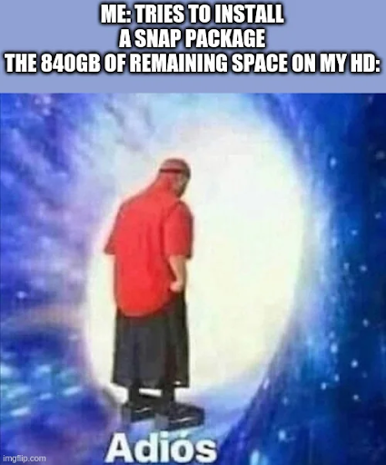

# Who dat?

<!-- column_layout: [5, 5, 1] -->

<!-- column: 0 -->


<!-- column: 1 -->

<!-- new_lines: 1 -->

## _Orhun Parmaksız_

<!-- pause -->

✨ Open Source Connoisseur (`github.com/orhun`)

🦀 Creator of **git-cliff**, kmon, gpg-tui, systeroid…

🐭 Project Leader @ **Ratatui**

📦 Package Maintainer @ Alpine & **Arch Linux** (btw)

`https://orhun.dev`

<!-- column: 2 -->

<!-- new_lines: 1 -->

  

<!-- end_slide -->

# VT100


<!-- pause -->

<!-- column_layout: [1, 2, 1] -->

<!-- column: 1 -->

> The VT100 terminal follows two programming standards - American National Standards Institute (ANSI) and VT52. In ANSI mode, the VT100 generates and responds to coded sequences per ANSI standards X3.41-1974 and X3.64-1977. In VT52 mode, the VT100 terminal is compatible with previous DIGITAL software using the VT52 video terminal.

<!-- end_slide -->

## VT100 Art

```bash +exec
mpv --quiet --loop-file /home/orhun/gh/eurorust2024/assets/twilight.mp4
```

<!-- pause -->

These are VT100 Animation files, which are meant to be thrown up raw at a vt100-compatible terminal.

[http://artscene.textfiles.com/vt100/](http://artscene.textfiles.com/vt100/)

| Animation                        | File Size | Description                                             |
| -------------------------------- | --------- | ------------------------------------------------------- |
| [bambi.vt](bambi.vt)             | 12818     | VT100 ANIMATION: Bambi vs. Godzilla                     |
| [dirty.vt](dirty.vt)             | 25081     | VT100 ANIMATION: Someone Having an Awful Amount of Fun  |
| [globe.vt](globe.vt)             | 29696     | VT100 ANIMATION: ABSOLUTELY EXCELLENT Spinning Globe    |
| [monkey.vt](monkey.vt)           | 51041     | VT100 ANIMATION: The Monkey Gives You The Finger        |
| [movglobe.vt](movglobe.vt)       | 250452    | VT100 ANIMATION: Incredible Spinning, Moving Globe      |
| [outerlimits.vt](outerlimits.vt) | 63832     | VT100 ANIMATION: The Outer Limits                       |
| [pac3d.vt](pac3d.vt)             | 17248     | VT100 ANIMATION: Pac Man in 3-D Chomping a Ghost        |
| [peace.vt](peace.vt)             | 79456     | VT100 ANIMATION: Imagine World Peace by John G. Poupore |

<!-- pause -->

<!-- new_lines: 2 -->

```sh
\033[4;9H\033[1mE\033[0m\033[12;69Hq\033[12;80Hq
\033[4;8H\033[1mR\033[0m\033[12;56Hq\033[12;53Hq
\033[4;5H\033[1mT\033[0m\033[12;75Hq\033[12;30Hq
\033[4;12H\033[1mS\033[0m\033[12;42Hq\033[12;27Hq
\033[4;11H\033[1mI\033[0m\033[12;28Hq\033[12;58Hq
```

<!-- column_layout: [1, 1, 1] -->

<!-- column: 1 -->

_Example ANSI escape sequences used above_

<!-- end_slide -->

## Turbo Vision


<!-- end_slide -->

## DOS Navigator


<!-- end_slide -->

# TUIs

<!-- column_layout: [1, 1] -->

<!-- column: 1 -->


<!-- column: 0 -->

<!-- pause -->

- 🔡 Made using text characters.

<!-- pause -->

```plaintext
┌─┬┐  ╔═╦╗  ╓─╥╖  ╒═╤╕
│ ││  ║ ║║  ║ ║║  │ ││
├─┼┤  ╠═╬╣  ╟─╫╢  ╞═╪╡
└─┴┘  ╚═╩╝  ╙─╨╜  ╘═╧╛
┌───────────────────┐
│  ╔═══╗ Some Text  │▒
│  ╚═╦═╝ in the box │▒
╞═╤══╩══╤═══════════╡▒
│ ├──┬──┤           │▒
│ └──┴──┘           │▒
└───────────────────┘▒
 ▒▒▒▒▒▒▒▒▒▒▒▒▒▒▒▒▒▒▒▒▒
```

<!-- pause -->

````rust
pub const ONE_EIGHTH_TOP_EIGHT: &str = "▔";
pub const ONE_EIGHTH_BOTTOM_EIGHT: &str = "▁";
pub const ONE_EIGHTH_LEFT_EIGHT: &str = "▏";
pub const ONE_EIGHTH_RIGHT_EIGHT: &str = "▕";

/// Wide border set based on McGugan box technique
///
/// ```text
/// ▁▁▁▁▁▁▁
/// ▏xxxxx▕
/// ▏xxxxx▕
/// ▔▔▔▔▔▔▔
````

<!-- end_slide -->

# TUIs

<!-- column_layout: [1, 1] -->

<!-- column: 1 -->


<!-- column: 0 -->

- 💻 Designed to run in a terminal or console.

<!-- pause -->

like this presentation! 🤡

[](https://github.com/mfontanini/presenterm)

<!-- pause -->

```bash +exec +acquire_terminal
btm
```

<!-- pause -->

- ⚡ Efficient and lightweight.

<!-- pause -->

**blazingly fast???** 🦀

<!-- end_slide -->

# GUIs

<!-- pause -->

> _bloat_

<!-- pause -->

<!-- column_layout: [1, 1, 1] -->

<!-- column: 0 -->



<!-- pause -->

<!-- column: 1 -->


<!-- pause -->

<!-- column: 2 -->


<!-- end_slide -->

# GUIs

> _bloat_

<!-- column_layout: [1, 1] -->

<!-- column: 1 -->


<!-- column: 0 -->

1. Higher complexity / excessive features.
2. Complex interfaces.
3. Performance issues.

<!-- pause -->

<!-- new_lines: 1 -->


<!-- end_slide -->

# Rust & TUIs


<!-- column_layout: [1, 1, 1] -->

<!-- column: 1 -->

[](https://github.com/fdehau/tui-rs)

<!-- reset_layout -->

<!-- pause -->


<!-- end_slide -->

# Rust & TUIs

```bash +exec +acquire_terminal
kmon
```

<!-- column_layout: [1, 1, 1] -->

<!-- column: 1 -->

[](https://github.com/orhun/kmon)

<!-- reset_layout -->

<!-- pause -->

## But then...

> Florian Dehau (author of `tui-rs`):
>
> Some of you may have noticed that my activity as the maintainer of `tui-rs` has significantly decreased
> over the past year. There are multiple reasons for that: my job is taking most of my creative coding energy
> (for good reasons), I don't use Rust enough (even though I miss it), and I have not used `tui-rs` for
> personal/work projects in a while, so my motivation to dedicate time to it is pretty low. None of that is
> likely going to change in the near future. At the same time, the popularity of the crate keeps growing, and
> I keep seeing it used in very cool projects. So it would be a shame if all of that goes to waste. As such,
> I'm currently thinking of ways to either find more maintainers or pass the torch to others who can better
> support the community and keep the project alive and thriving.

[](https://github.com/fdehau/tui-rs/issues/654)

<!-- end_slide -->

## Timeline

| Date       | Event                                                             |
| ---------- | ----------------------------------------------------------------- |
| 14-08-2022 | Discussion on the future of `tui-rs` begins.                      |
| 02-02-2023 | Discord server created to explore forking the project.            |
| 08-02-2023 | Original author proposes a plan for transferring ownership.       |
| 14-02-2023 | Fork created to continue development (`tui-rs-revival`).          |
| 18-02-2023 | First Ratatui meeting held.                                       |
| 19-03-2023 | Ratatui's first version released.                                 |
| 01-04-2023 | Second Ratatui meeting.                                           |
| 29-05-2023 | Ratatui 0.21.0 released.                                          |
| 15-07-2023 | Biggest Ratatui meeting to date!                                  |
| 17-07-2023 | Ratatui 0.22.0 released.                                          |
| 07-08-2023 | `tui-rs` archived, **Ratatui** becomes the official successor! 🎉 |

<!-- pause -->

### `RUSTSEC-2023-0049`

tui is unmaintained; use ratatui instead

> The `tui` crate is no longer maintained.
>
> Consider using the `ratatui` crate instead.

<!-- end_slide -->

## Renaissance


---

<!-- column_layout: [1, 1, 1] -->

<!-- column: 1 -->

🐁 https://ratatui.rs

⭐ https://github.com/ratatui

🌐 https://forum.ratatui.rs

<!-- reset_layout -->

<!-- pause -->

### The Vision

1\. Ease of Use

> Improving usability by addressing key issues like widget tracking, scrollable widgets, and simplifying examples.

2\. Visual Appeal

> Improving aesthetics and customization options to make Ratatui more visually appealing and attention-grabbing.

---

\- [](https://github.com/ratatui/ratatui/issues/1321)


<!-- end_slide -->

## Demo

```bash +exec +acquire_terminal
cargo run --manifest-path /home/orhun/gh/ratatui/Cargo.toml --example demo2 --features crossterm,palette,widget-calendar
```

<!-- end_slide -->

### Development


```bash
$ cargo install cargo-generate

$ cargo generate ratatui/templates
```

<!-- pause -->

<!-- new_lines: 1 -->

```bash +exec +acquire_terminal
$EDITOR /home/orhun/gh/ratatui-templates/simple-generated
```

<!-- end_slide -->

### Minimal Example

```file {5-31|6-10|12-13|14-24|26-29|30|5-31} +line_numbers +exec +acquire_terminal
path: code/src/minimal.rs
language: rust-script
```

<!-- end_slide -->

## Concepts

<!-- pause -->

### Rendering

```rust {1-16|1|1,4,9|6,11|1-16} +line_numbers
let mut toggle = false;
loop {
    terminal.draw(|frame: &mut Frame| {
        if toggle {
            frame.render_widget(
                BarChart::default()
                //...
            );
        } else {
            frame.render_widget(
                LineGauge::default()
                //...
            );
        }
    });
}
```

<!-- pause -->

```bash +exec +acquire_terminal
cargo run --manifest-path /home/orhun/gh/eurorust2024/code/Cargo.toml --bin rendering
```


<!-- end_slide -->

### Widgets

- Block, BarChart, Calendar, Canvas, Chart, Gauge, LineGauge, List, Paragraph, Scrollbar, Sparkline, Table, Tabs

<!-- pause -->

```rust +line_numbers
pub trait Widget {
    /// Draws the current state of the widget in the given buffer.
    fn render(self, area: Rect, buf: &mut Buffer) where Self: Sized;
}
```

<!-- pause -->

```rust +line_numbers
pub struct RandomColorWidget {
    rng: rand::rngs::ThreadRng,
}
```

<!-- pause -->

```file {1-20|13-16} +line_numbers
path: code/src/widget/widget.rs
language: rust
```

<!-- end_slide -->

```file {1-25|8-10|11-16|17-24|1-25}+line_numbers
path: code/src/widget/render.rs
language: rust
```

<!-- pause -->

<!-- new_lines: 1 -->

```bash +exec +acquire_terminal
cargo run --manifest-path /home/orhun/gh/eurorust2024/code/Cargo.toml --bin widget
```


<!-- end_slide -->

### Buffer

```file {1-16|4-5|6-15|1-16} +line_numbers
path: code/src/widget/test.rs
language: rust
```

<!-- pause -->

```svgbob
        0     1     2     3     4     5     6     7     8     9    10    11
     ┌─────┬─────┬─────┬─────┬─────┬─────┬─────┬─────┬─────┬─────┬─────┬─────┐
   0 │  H  │  e  │  l  │  l  │  o  │     │  W  │  o  │  r  │  l  │  d  │  !  │
     ├─────┼─────┼─────┼─────┼─────┼─────┼─────┼─────┼─────┼─────┼─────┼─────┤
   1 │     │     │     │     │  ▲  │     │     │     │     │     │     │     │
     ├─────┼─────┼─────┼─────┼─ │ ─┼─────┼─────┼─────┼─────┼─────┼─────┼─────┤
   2 │     │     │     │     │  │  │     │     │     │     │     │     │     │
     ├─────┼─────┼─────┼─────┼─ │ ─┼─────┼─────┼─────┼─────┼─────┼─────┼─────┤
   3 │     │     │   ┌──────────┴──────────┐   │     │     │     │     │     │
     └─────┴─────┴── │ ┴─────┴─────┴─────┴ │ ──┴─────┴─────┴─────┴─────┴─────┘
                     │                     │
              ┌──────┴──────┐       ┌──────┴──────┐
              │   symbol    │       │    style    │
              │             │       │             │
              │     “o”     │       │ fg":"Reset  │
              │             │       │ bg":"Reset  │
              └─────────────┘       └─────────────┘
```

<!-- end_slide -->

### Dynamic Layouts

```rust {1-9|2|3-7|9|1-9} +line_numbers
let layout = Layout::default()
    .direction(Direction::Horizontal)
    .constraints(&[
        Constraint::Length(10),
        Constraint::Percentage(70),
        Constraint::Min(5),
    ])
    .split(frame.area());
```

<!-- pause -->

```file +line_numbers
path: code/src/layout/layout.rs
language: rust
```

<!-- pause -->

#### Constraints

```bash +exec +acquire_terminal
cargo run --manifest-path /home/orhun/gh/ratatui/Cargo.toml --example constraints
cargo run --manifest-path /home/orhun/gh/ratatui/Cargo.toml --example constraint-explorer
```

#### Flex

```bash +exec +acquire_terminal
cargo run --manifest-path /home/orhun/gh/ratatui/Cargo.toml --example flex
```

<!-- end_slide -->

### Miscellaneous

<!-- pause -->

#### Styling

```rust +line_numbers
let styled_text = "Styling is easy".black().on_magenta();
let bold_italic_text = "Look ma! Bold and italic".bold().italic();
let mixed_line = vec![
    "And ".fg(Color::Yellow),
    "mixed".bg(Color::Indexed(1)),
    " styling".fg(Color::Rgb(100, 200, 200)),
];
```

```bash +exec +acquire_terminal
cargo run --manifest-path /home/orhun/gh/eurorust2024/code/Cargo.toml --bin styling
```

<!-- pause -->

#### Macros

[](https://github.com/ratatui/ratatui-macros)

```rust
constraints![==50, ==30%, >=3, <=1, ==1/2, *=1],
```

<!-- pause -->

#### Logging

[](https://github.com/gin66/tui-logger)

```bash +exec +acquire_terminal
cargo run --manifest-path /home/orhun/gh/tui-logger/Cargo.toml --example demo --features crossterm
```

<!-- end_slide -->

## Showcase

### Tachyonfx

> Provides a collection of effects that can be used to enhance the
> visual appeal of terminal applications, offering capabilities such as color
> transformations, animations, and complex effect combinations.

[](https://github.com/junkdog/tachyonfx)

```bash +exec +acquire_terminal
cargo run --manifest-path /home/orhun/gh/tachyonfx/Cargo.toml --example tweens
```

<!-- pause -->

### Snake AI

[](https://github.com/bones-ai/rust-snake-ai-ratatui)

<!-- pause -->

### Kartoffels

[](https://github.com/Patryk27/kartoffels)

<!-- pause -->

### TheaTTYr

```bash +exec +acquire_terminal
theattyr twilightzone.vt
```

[](https://github.com/orhun/theattyr)

<!-- end_slide -->

# Thank you!

<!-- column_layout: [1, 1, 1] -->

<!-- column: 0 -->

## Reach out

- [](orhun.dev)
- [](https://github.com/orhun)

<!-- column: 1 -->

## Socials

- @orhun@fosstodon.org
- Twitter: @orhundev
- YouTube: @orhundev
- LinkedIn: @orhunp\_

<!-- column: 2 -->

## Ratatui

- [](https://ratatui.rs)
- [](https://github.com/ratatui)

<!-- reset_layout -->


<!-- column_layout: [1, 1, 1] -->

<!-- column: 1 -->

# Any questions?

Slides: [](https://github.com/orhun/eurorust2024)

TODO: Add QR code
